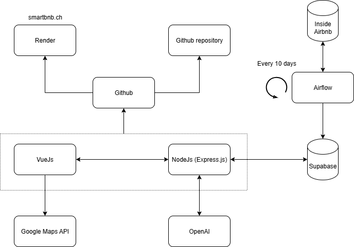

# Description of the architecture

## Schema

### Pipeline
The **Airflow (Astronomer)** pipeline will:
1. Fetch new Airbnb data from **Inside Airbnb** every 10 days.  
2. Clean and transform the new data.  
3. Store the processed data into our database on **Supabase**.  
4. Trigger updates for the backend to serve the latest data.

### Backend
The backend will be implemented using **Node.js (Express.js)** and deployed on **Render**.  
It will expose several REST endpoints and serve as the bridge between **Supabase**, **OpenAI**, and the **Vue.js frontend**.

### Frontend
The frontend will be built using **Vue.js** and deployed on **Render**.  
It will include:
- **AI evaluation** on an airbnb (using the **OpenAI API**)
- **Leaflet + OpenStreetMap** maps to display the prices per neighborhood (no API key)  
- **Charts and graphs** for seasonal trends (using **Chart.js**)
- **Interactive filters** (date range, neighborhood, property type)  

### External Services
- **OpenAI API (ChatGPT)** → generate insights and explanations on the evaluations.