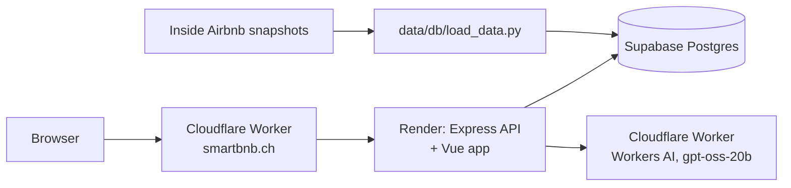

# SmartBnB

**Is this Airbnb a good deal?** Paste an Airbnb listing from canton Vaud,
Switzerland, and SmartBnB compares it with similar stays nearby: price, review
activity, amenities and host status, summed up in a score out of 100.

**Live at [smartbnb.ch](https://www.smartbnb.ch)**

https://github.com/user-attachments/assets/e4382435-9a17-4f5f-85fb-becbc3c5df38

## What it does

- **Check a listing.** Paste a link like `https://www.airbnb.ch/rooms/53584592`
  and get a SmartScore out of 100, the nightly price against the median of the
  same room type in the same neighbourhood, the rating, review activity and
  key amenities.
- **Read a short analysis.** An open-weights language model turns those
  numbers into strengths and points to watch out for.
- **Explore the region.** A price map of the active listings, Top 10 lists
  (best rated, cheapest, most reviewed this year) and price trends by district.

## How the score works

Each listing is compared with the same room type in the same neighbourhood:

| Part | Weight | Better when |
|---|---|---|
| Price | 45% | the nightly price is below the local median |
| Review activity | 30% | the listing gets more reviews per month than the area |
| Key amenities | 15% | it has the amenities guests look for most |
| Superhost | 10% | the host is a Superhost |

The code is in
[`smartbnb/backend/src/utils/score.utils.js`](smartbnb/backend/src/utils/score.utils.js).

## Architecture



| Folder | Content |
|---|---|
| [`smartbnb/frontend`](smartbnb/frontend) | Vue 3 + Vite app, Leaflet maps on OpenStreetMap |
| [`smartbnb/backend`](smartbnb/backend) | Node.js + Express API, also serves the built app |
| [`data`](data) | Inside Airbnb snapshots and the loader that fills the database |
| [`cloudflare`](cloudflare) | Workers: domain relay, AI endpoint, keep-alive |
| [`docs`](docs) | Guides for running, deploying and operating the app |

## Run it locally

You need Node.js 22 and a Postgres database loaded with the data (see
[data/db/README.md](data/db/README.md)).

```bash
cp smartbnb/backend/.env.example smartbnb/backend/.env   # set DATABASE_URL

cd smartbnb/frontend && npm ci && npm run build
cd ../backend && npm ci && npm start                       # http://localhost:3000
```

The AI analysis is optional: without an AI key the score is shown alone. Tests
run with `npm test` in `smartbnb/backend` and need no database. Docker and
production setup: [docs/deployment.md](docs/deployment.md).

## Data

Listing data comes from [Inside Airbnb](https://insideairbnb.com/) and is
licensed under
[CC BY 4.0](https://creativecommons.org/licenses/by/4.0/). Every monthly
snapshot since July 2024 is in [`data/`](data), compressed, so the database can
be rebuilt from a clone without depending on Inside Airbnb keeping its
archives online. New snapshots are downloaded with
`python data/db/load_data.py --fetch` and committed.

Since June 2026 the Inside Airbnb snapshots for Switzerland no longer contain
usable prices. Current prices are collected from Airbnb once a month instead,
see [data/prices](data/prices/README.md). Each result shows the date its price
was seen.

## Documentation

- [Running and deploying](docs/deployment.md)
- [API](docs/api.md)
- [CI and deployment](docs/ci.md)
- [Operations](docs/operations.md): keep-alive, uptime checks, alerts, backups
- [Data loading](data/db/README.md) and [Cloudflare Workers](cloudflare/README.md)

## Contributing

Issues and pull requests are welcome. Start with the
[`good first issue`](https://github.com/AdamoElProfesor/SmartBnB/labels/good%20first%20issue)
label and read [CONTRIBUTING.md](CONTRIBUTING.md). Security problems:
[SECURITY.md](SECURITY.md).

## Credits

SmartBnB started in 2025 as a student project at HEIG-VD by Adam Gruber
([@AdamoElProfesor](https://github.com/AdamoElProfesor)), Axel Pittet
([@Axwells](https://github.com/Axwells)) and
[@CestPolo](https://github.com/CestPolo). It is now maintained by Adam Gruber.

## License

The code is released under the [MIT License](LICENSE). The data keeps its own
license, see [Data](#data).
